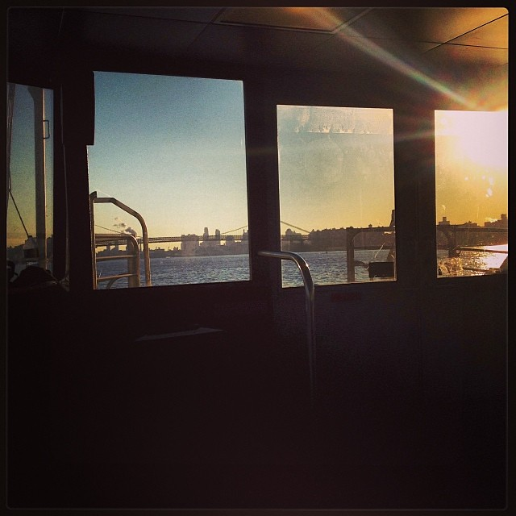
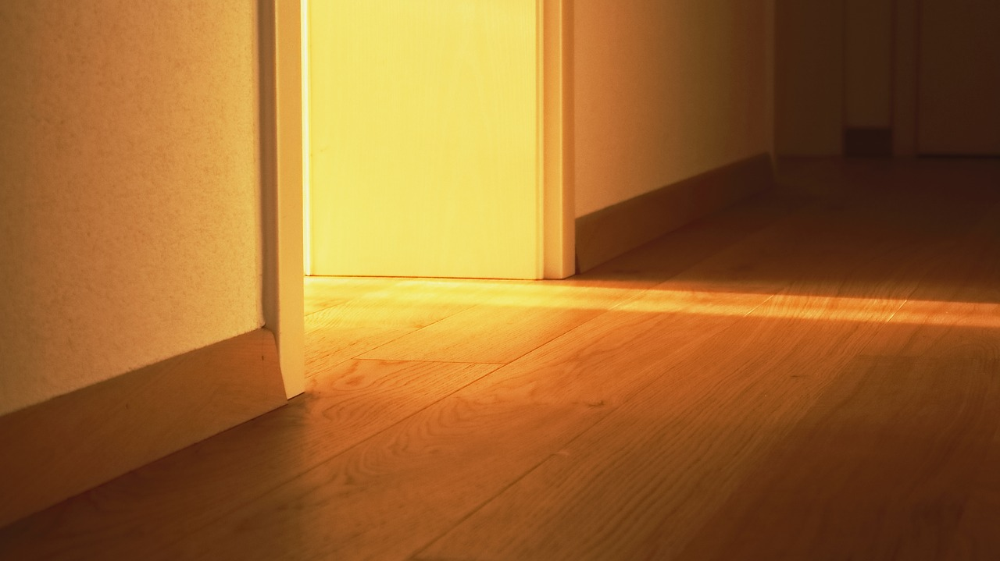

## Now you are at home.  
One day, you see that the window and the door are shining bright light. You are very curious and went up to see it. You see that the window is shining blue light and the door is shining golden light. So based on your opinion, would you like to jump out the window or enter the door?  
Would you rather go 
### [JUMP OUT THE WINDOW](past/past.md)  
  
### [ENTER THE DOOR.](future/future.md)
